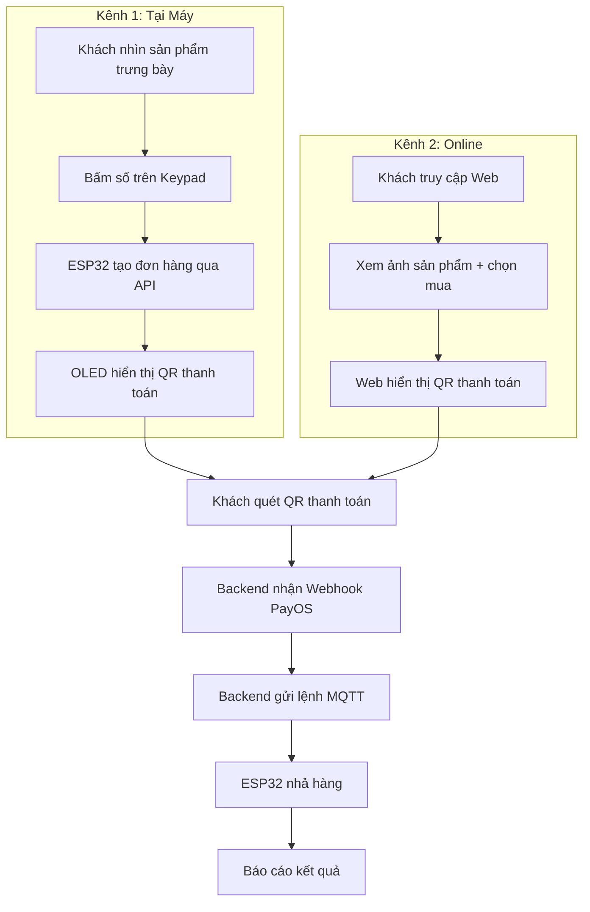

# 🗺️ Bản Kế Hoạch Hoàn Thiện Phần Cứng & Firmware - Vending Machine V2

> Tài liệu này mô tả chi tiết các bước thiết kế phần cứng và lập trình Firmware cho ESP32-S3,  
> đảm bảo tích hợp hoàn hảo với hệ thống Backend và Frontend đã chuẩn hóa.

---

## 📝 Nhắc Lại Quy Tắc Dự Án
- **Ngôn ngữ:** Tiếng Việt 100% (Mô tả, Comment code, Giao tiếp).

---

## 🏗️ Mô Hình Vận Hành: Hybrid (Kép)

| Kênh | Cách mua | Giao diện |
| :--- | :--- | :--- |
| **🖐️ Kênh 1: Tại máy** | Khách nhìn sản phẩm trưng bày → Bấm số trên bàn phím Keypad → QR thanh toán hiện trên OLED → Máy nhả hàng | Keypad + OLED |
| **🌐 Kênh 2: Online** | Khách truy cập web → Xem ảnh sản phẩm → Chọn mua → Thanh toán QR → Đến máy nhận hàng | Trang web |

---

## 📋 1. Sơ Đồ Kết Nối Phần Cứng (Pinout ESP32-S3)

| Linh kiện | Chân (Pin) | Loại | Mô tả |
| :--- | :--- | :--- | :--- |
| **Màn hình OLED** | SDA: 8, SCL: 9 | I2C | Hiển thị trạng thái, QR thanh toán, kết quả |
| **Bàn phím Keypad** | Tùy cấu hình (ma trận hàng/cột) | Input | Khách bấm số (1-9) tương ứng vị trí sản phẩm |
| **Đèn LED MQTT** | 3 | Output | Sáng khi kết nối thành công Broker MQTT |
| **Built-in LED** | 43 | Output | Sáng khi có kết nối WiFi |
| **Motor Slot 1** | 1 | PWM/Out | Điều khiển nhả hàng vị trí 1 |
| **Motor Slot 2** | 2 | PWM/Out | Điều khiển nhả hàng vị trí 2 |
| **Motor Slot 3** | 4 | PWM/Out | Điều khiển nhả hàng vị trí 3 |
| **Motor Slot 4** | 5 | PWM/Out | Điều khiển nhả hàng vị trí 4 |

---

## 🔄 2. Quy Trình Hoạt Động (Workflow)

### 📌 Kênh 1: Mua tại máy

```
1. Khởi động → OLED hiển thị "SẴN SÀNG — Bấm số để chọn hàng"
2. Khách nhìn sản phẩm trưng bày trong máy (chai nước, snack,...)
3. Khách bấm phím số tương ứng trên Keypad (VD: phím "3" = vị trí 3)
4. ESP32 gọi API Backend tạo đơn hàng cho sản phẩm tại slot đó
5. OLED hiển thị QR Code thanh toán + giá tiền
6. Khách quét QR bằng app ngân hàng → Chuyển tiền
7. Backend nhận Webhook PayOS → Gửi MQTT lệnh nhả hàng tới ESP32
8. ESP32 kích hoạt Motor → Nhả sản phẩm
9. OLED hiển thị "THÀNH CÔNG! Mời lấy hàng."
10. Sau 5 giây → Quay lại màn hình chờ
```

### 📌 Kênh 2: Mua online

```
1. Khách truy cập trang web (có thể quét QR trên thân máy)
2. Web hiển thị danh sách sản phẩm kèm ảnh và giá
3. Khách chọn sản phẩm → Thanh toán QR PayOS trên web
4. Backend nhận thanh toán → Gửi MQTT lệnh nhả hàng tới ESP32
5. ESP32 kích hoạt Motor → Nhả sản phẩm
6. Web hiển thị "Nhả hàng thành công! Vui lòng nhận tại máy."
```

### 📌 Sơ đồ tổng quan



---

## 📋 3. Kế Hoạch Chi Tiết Theo Giai Đoạn

### 🏗️ Giai Đoạn 1: Chuẩn hóa & Kết nối (Ưu tiên cao)
- [ ] **Sửa lỗi Config:** Cập nhật `MQTT_SERVER` và `TOPIC` đồng bộ với Backend V2.
- [ ] **Hoàn thiện WiFiManager:** Cơ chế tự động kết nối lại (Auto-reconnect) khi mất mạng.
- [ ] **Tạo APIClient:** ESP32 gọi REST API (`POST /orders/`, `GET /iot/check-order`) để tạo đơn hàng và kiểm tra trạng thái.

### ⚙️ Giai Đoạn 2: Keypad & Điều khiển Motor
- [ ] **Tích hợp Keypad:** Đọc phím số từ bàn phím ma trận, mapping số → slot sản phẩm.
- [ ] **Tích hợp MotorControl:** Điều khiển chính xác motor nhả hàng theo slot.
- [ ] **Phản hồi trạng thái:** Gửi MQTT hoặc gọi API xác nhận `success: true/false` sau mỗi lần nhả hàng.

### 🖥️ Giai Đoạn 3: Giao diện OLED
- [ ] **Màn hình chờ:** Hiển thị "SẴN SÀNG — Bấm số để chọn hàng" + IP nếu cần.
- [ ] **Hiển thị QR Code:** Sau khi khách bấm số → OLED vẽ QR code thanh toán (128x64 pixel).
- [ ] **Hiển thị kết quả:** Thành công / Thất bại / Hết thời gian.
- [ ] **Hiển thị trạng thái:** WiFi, MQTT, IP máy.

### 🛡️ Giai Đoạn 4: Bảo mật & Ổn định
- [ ] **Xác thực X-Machine-Key:** Mọi yêu cầu API từ ESP32 phải kèm khóa bí mật.
- [ ] **Watchdog Timer:** Tự động khởi động lại nếu Firmware bị treo.
- [ ] **Heartbeat:** Gửi nhịp tim 30 giây/lần qua `POST /iot/heartbeat`.
- [ ] **Logging:** Gửi nhật ký hoạt động về backend.

---

## 📁 4. Cấu Trúc Mã Nguồn (Đề xuất)

```
firmware/
├── include/
│   └── config.h              # Cấu hình Pin, WiFi, MQTT, Machine Key
├── src/
│   └── main.cpp              # Luồng xử lý chính
└── lib/
    ├── WiFiManager/          # Quản lý kết nối WiFi
    ├── MQTTManager/          # Quản lý gửi/nhận tin nhắn MQTT
    ├── DisplayManager/       # Điều khiển OLED: QR, trạng thái, kết quả
    ├── MotorControl/         # Điều khiển động cơ nhả hàng
    ├── KeypadHandler/        # Đọc phím số từ bàn phím Keypad
    └── APIClient/            # Giao tiếp REST API với Backend
```

---

## 🚀 5. Các bước thực hiện tiếp theo

1. **Cập nhật `config.h`:** Thêm chân Keypad, Machine Key.
2. **Viết module `KeypadHandler`:** Đọc phím số + debounce.
3. **Viết module `APIClient`:** Gọi `POST /orders/` và `GET /iot/check-order`.
4. **Nâng cấp `DisplayManager`:** Hiển thị QR code và trạng thái.
5. **Thử nghiệm nhả hàng:** Bấm phím → Tạo đơn → Nhả hàng.

---
*Tài liệu này được soạn thảo để hướng dẫn thi công thực tế Phần cứng theo Mô hình Hybrid (Kép).*
